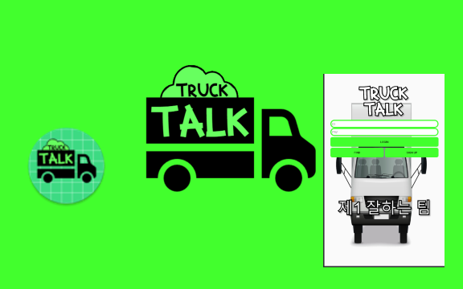

# TruckTalk
학교 프로젝트
네트워크 프로그래밍 수업에서 네트워크 기반으로 프로젝트를 완성.
Firebase를 활용하여 프로젝트 기반을 다지고 카카오톡 대화방처럼 구현.

# 개요
제1 잘하는 팀 (1조)로 팀 결성.
프로젝트 컨셉안 = 대화방

# 활용
파이어베이스 활용
안드로이드 스튜디오 플랫폼 활용
머터리얼, 싸이클 뷰, 나인패치 활용

# 사용법
파이어베이스 API 키를 얻어내야 함.
즉, 파이어베이스의 프로젝트 생성 과정에서 API 키가 들어있는 google-service.json 파일이 있음.
나머지 경로는 직접 보삼.

# Version
## 1(1.0.0)
로그인, 회원가입, 아이디 및 비밀번호 찾기 기능 추가.
반응형 레이아웃 리소스 추가.

## 2(1.0.1)
최소 타겟 SDK 버전 29에서 26버전으로 낮춤.(Android 10(Q) -> Android 8(Oreo)

## 2(1.0.2)
자동 로그인 기능 추가.
대화방 내에서 로그아웃 기능 추가.

